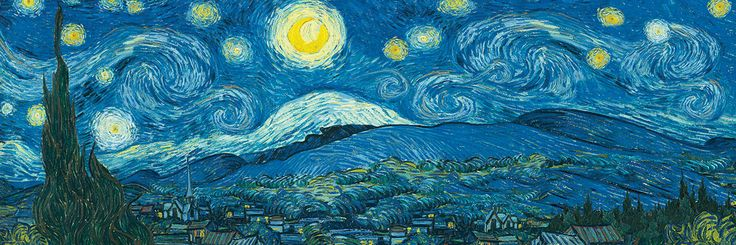

## Chào bạn! Mình là Huy 👋 

Mình là một coder yêu thích khám phá, hay "vọc vạch" mọi thứ liên quan đến lập trình – từ game, ứng dụng, đến cả thuật toán.  
Hiện tại mình đang tìm hiểu về lập trình C++, Python, **Unity Engine, Unreal Engine** và các công nghệ mới thú vị khác.

💻 Mình thích dành hàng giờ để code, sửa bug (và tạo bug mới 😅)  
🎮 Đam mê game, nên cũng thích làm game!  
📚 Luôn cố gắng học hỏi mỗi ngày, sai thì sửa, ngại gì 😎

### 🌐 Socials:

 

### 💻 Tech Stack:
                
<!-- Proudly created with GPRM ( https://gprm.itsvg.in ) -->
---

> “Không phải lúc nào bạn cố gắng cũng sẽ thành công, nhưng phải luôn cố gắng để không hối tiếc khi thất bại.”

---
